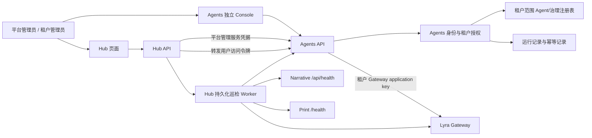

# Lyra Hub 自动维护与 Agents 多租户设计

- 日期：2026-10-03
- 状态：设计评审稿
- 涉及项目：Lyra Hub、Lyra Agents；复用 Lyra Gateway 现有租户/应用密钥 API；巡检 Narrative 与 Print

## 1. 目标与范围

本期让 Hub 提供平台运维与租户管理页面，让 Agents 支持账号/API 凭据两种身份、平台管理员和租户管理员分级，以及受控的单 Agent 模型调用。Agents 可独立部署使用；接入 Hub 后，Hub 提供平台级管理和运维入口，但不接管 Agent 定义和租户身份。

本期交付：

1. Hub 的租户管理、维护中心、告警和需管理员确认的修复入口。
2. Agents 的账号登录、租户管理员、租户 API 凭据、Gateway 租户凭据管理。
3. Agents 的 Agent/Role/Persona/Skill/版本数据全租户隔离，以及租户隔离的单 Agent 运行记录。
4. 单 Agent 单轮文本模型调用 API 和 Agents 页面运行入口；由 Agents 调用 Gateway。
5. 对 Hub、Gateway、Agents、Narrative、Print 的后台定时只读巡检。

本期不交付 Workflow DAG 执行、Agent 工具/代码执行、流式输出、容器自动重启、业务应用租户隔离、外部告警通知渠道、跨项目 OIDC 单点登录。Narrative 和 Print 只接入 Hub 巡检，不改变其现有业务和数据模型。

## 2. 已确认的产品决策与实施假设

用户已确认：

- 自动维护包含定时巡检与告警；任何修复都必须由管理员确认。
- Agents 严格隔离租户定义、凭据和运行记录，提供平台管理员/租户管理员两级角色。
- Agents 自主管理账号和租户身份；Hub 集成时转发 Agents 用户身份，不成为 Agents 身份权威。
- 本期应支持单 Agent 调用模型；Workflow 执行继续暂缓。

本期采用以下默认策略，作为验收依据：

- 巡检周期默认 5 分钟，可配置；连续 2 次失败后创建/升级告警。
- 告警首期显示在 Hub 内，不发送邮件、短信或 IM 通知。
- 不保存运行输入；模型输出加密保留 7 天，运行元数据和幂等墓碑保留 90 天。
- Agents 首期保留 SQLite 单实例部署；仓储边界保持可替换。多实例/高并发部署前必须完成 PostgreSQL 支持和容量验证。

## 3. 当前代码事实

- Hub 已有 Gateway、Agents 连接页面/API、应用目录、审计记录和 SQLite/SQLAlchemy 持久化；还没有持久化巡检调度和告警中心。
- Agents 已有 Agent 与版本注册、Role/Persona/Skill 治理、Workflow 编译预览、账号/API 凭据认证、多租户隔离、租户 Gateway 凭据和单 Agent 单轮运行 API；Workflow Executor 仍未通过 HTTP 暴露。Hub 只代理明确白名单里的身份、租户管理和配置路由，不代理运行 API。
- Gateway 已有 tenants、applications、应用密钥校验、按 tenant/application 归属用量的能力。应用密钥只表达调用应用所属租户，不代表人类管理员角色。
- Narrative 有 `/api/health`；Print 有 `/health` 与 `/actuator/health`。

## 4. 架构与权威数据



权威边界：

| 数据/能力 | 权威方 | Hub 的职责 |
|---|---|---|
| 用户身份、Agents 租户、Agent 与治理资源、Agent 运行 | Agents | 展示、平台代理管理、按用户身份转发请求 |
| Provider、模型路由、额度、成本、Gateway 用量 | Gateway | 展示连接/健康；帮助关联租户；不复制 Provider 密钥 |
| 巡检计划、平台告警、维护操作审计、Hub 服务连接 | Hub | 持久化并执行平台级维护流程 |
| Narrative/Print 业务数据 | 各业务应用 | 仅检查存活/就绪，不读取业务内容 |

### 4.1 日志、运行记录与公告存储

- **Agent 运行记录**：存 Agents 自己的数据库，带 `tenant_id` 和调用主体；不保存输入，模型输出按本期策略加密保存 7 天，运行元数据保存 90 天。明文输出只回给发起运行的主体；管理员只看元数据。Agents 只保存 Gateway request ID 和必要的用量快照用于运行详情；Gateway 的计费/额度记录仍以 Gateway 数据为准。
- **运行期限与清理**：Gateway 请求及完整响应体读取受绝对 240 秒 deadline 约束，早于 5 分钟的 stale-running 回收阈值；不能以 HTTP 读取空闲超时替代总时限。Agents lifespan 启动时清理，并每分钟后台清理 7 天输出和 90 天元数据，不依赖 API 流量。
- **平台巡检和维护**：巡检结果摘要、告警状态、修复确认和 Hub 操作审计存 Hub 数据库。高频原始日志、栈追踪和请求明细发到标准输出/集中日志平台，Hub 数据库只保留查询所需的结构化摘要、关联 ID 和时间。
- **认证/资源审计**：登录、租户管理、Agent/治理资源改动由 Agents 记录；模型调用与费用由 Gateway 记录；连接配置和跨项目维护由 Hub 记录。各服务只写自己拥有的审计事件，敏感字段脱敏且审计记录追加写入。
- **公告**：平台级运维公告属于 Hub 数据，由 Hub 数据库持久化，记录发布者、发布时间、可见范围和状态；可见范围可以是全平台，或关联一个 Agents tenant ID 的租户公告。公告正文不写应用日志。Narrative/Print 的业务公告仍由相应业务应用拥有。本期设计只确定归属，不新增公告编辑/发布页面。
- **部署方式**：单机阶段应用日志写 stdout，由容器日志驱动采集；扩展部署时接 OpenTelemetry/集中日志平台。不要把完整 Prompt、模型输出、Authorization 或密钥写进日志/追踪标签。

Agents 以 tenant-aware Application Service/Repository 实现共享表隔离。每个租户资源、版本、凭据和运行记录都有 `tenant_id`；复合唯一键/外键防止跨租户引用。身份中间件只从经过认证的账号会话或 API 凭据生成租户上下文，业务参数不得覆盖。跨租户读取统一返回 404，避免泄漏资源是否存在。

Agents 本地/小规模部署首期继续用 SQLite；不承诺多副本并发扩展。正式多实例扩展需切换并验证 PostgreSQL、任务租约和备份恢复。模块接口与版本化 API 为后续增加数据库实现、OIDC 和执行 Runtime 留扩展点，不预先引入消息中间件或拆分微服务。

## 5. 身份、角色与凭据

### 5.1 角色权限

| 操作 | 平台管理员 | 租户管理员 |
|---|---:|---:|
| 全局租户列表/创建/停用 | 是 | 否 |
| 查看/编辑跨租户 Agent 与运行元数据 | 是，需显式选租户 | 否 |
| 本租户 Agent/Role/Persona/Skill 管理 | 是 | 是 |
| 创建/停用本租户管理员 | 是 | 是，仅本租户 |
| 创建/撤销本租户 API 凭据 | 是 | 是 |
| 配置本租户 Gateway application credential | 是 | 是 |
| 查看/确认平台维护操作 | 是 | 否 |
| 查看全平台 Gateway Provider 密钥 | 否；仍由 Gateway 管理 | 否 |

本期只有两种人工角色：平台管理员和租户管理员。一个租户可有多个租户管理员，租户管理员只能邀请同租户的其他租户管理员；不增加普通成员角色。平台管理员初始账号通过一次性 CLI/bootstrap 创建，不设置默认口令。创建租户或邀请管理员时签发一次性邀请凭据；受邀管理员首次登录设置自己的口令。口令用 Argon2id 等专用密码哈希算法保存。登录使用短期访问令牌和可撤销/轮换刷新凭据。

租户 API 凭据是独立的机器身份，不是第三种人类角色。它绑定一个 tenant、签发者和有限 scope（首期 `agents:read`、`agents:run`），仅创建/轮换时显示明文，库内保存摘要、前缀、scope、过期时间和最近使用时间。运行记录以 `principal_type` 和 `principal_id` 记录发起主体，幂等范围使用 `(tenant_id, principal_type, principal_id, key_hash)`。

Hub 登录调用由 Agents 提供的认证入口。Hub 通过后端代理 Agents 用户请求时转发用户访问令牌；另用单独的、加密保存的服务凭据调用 Agents 平台管理接口。平台管理凭据不得作为租户用户身份或 Gateway 模型调用凭据使用。现有 Hub `LYRA_HUB_ADMIN_TOKEN` 在迁移期作为 break-glass 运维凭据，不替代 Agents 的人类角色体系。Agents 不可用时，break-glass 只允许查看 Hub 已持久化的告警/巡检信息并恢复 Hub 上游连接配置；不能绕过 Agents 授权读取或修改租户数据。

平台管理员停用租户是立即生效的访问控制状态：每次 Agents API 请求均验证租户仍启用；停用时撤销该租户全部登录会话、刷新令牌和 API 凭据，停用完成后的新请求统一拒绝。重新启用租户不会恢复已撤销的 API 凭据，需要租户管理员重新签发。已发送到 Gateway 的在途模型请求不支持撤回，可能仍被计费；它可完成并写入加密运行记录，但租户停用期间记录和输出均不可访问。停用不删除 Agent 数据、密文或审计信息。

### 5.2 Gateway 凭据

- Gateway application key 按 Agents tenant ID 与 Gateway tenant/application 关联；Gateway 继续负责校验、额度和费用统计。
- Agents 为每个租户保存独立 Gateway application key 的密文、应用 ID、状态、更新时间和默认模型。密钥可测试、轮换和撤销；API 只返回是否已配置及脱敏前缀。
- Gateway key 使用部署密钥加密（例如 Fernet/KMS 接口）；密钥缺失、解密失败或 Gateway 鉴权失败均明确报错，禁止退回其他租户或全局 token。
- Provider 上游密钥始终留在 Gateway。

## 6. 页面与交互

### 6.1 Hub

1. **总览**：展示 Hub/Gateway/Agents/Narrative/Print 当前状态、最近巡检时间、未处理告警数；区分存活、就绪、目录/认证检查失败。
2. **租户管理**：平台管理员可创建、停用、查看租户管理员和 Gateway 关联状态；停用确认框提示会话/API 凭据立即失效和在途调用可能仍计费。停用是可恢复状态，不级联物理删除资源；重新启用需重新签发 API 凭据。租户创建跨 Agents/Gateway 部分失败时保留可重试的 `provisioning`/`gateway_unlinked` 状态，不做不可逆自动补偿。
3. **Agents**：平台管理员必须显式选择租户；租户管理员自动固定到自身租户。可查看/管理该租户 Agent、治理目录和模型连接状态。具体定义编辑沿用 Agents API/Console，Hub 不复制为另一套真相。
4. **维护中心**：服务卡片、巡检间隔、上次/下次执行、失败分类、延迟、告警时间线、检查详情和建议动作。具备权限的管理员可手动“立即巡检”。
5. **告警/操作**：告警状态含 `open`、`acknowledged`、`action_pending`、`resolved`、`ignored`。展示建议、预期影响、目标配置修订号、操作者与执行结果。确认动作要求二次确认，使用幂等键和乐观修订号。
6. **Gateway**：复用现有连接/模型目录页面；租户页面只显示租户关联与连接状态，不泄漏其他租户应用密钥和用量。

### 6.2 Agents Console

登录、当前租户和账号、Agent 管理、版本发布/回滚、Role/Persona/Skill 管理、Workflow 编译预览、Gateway 连接与凭据页、单 Agent 运行页、运行记录列表/详情、API 凭据与租户管理员页。租户管理员永远不能切换 tenant ID。平台管理员跨租户操作需显式选择目标租户并写审计。租户管理员只能创建同级管理员，不存在普通成员权限。

运行页面明确提示单次调用会访问 Gateway 并消耗该租户额度；提交后显示 Agent 固定版本、Gateway request ID、模型、耗时、用量、结果与可识别错误。页面不提供工具执行或 Workflow 运行按钮。

## 7. Agent 单轮执行契约

### 7.1 请求与成功响应

建议新增版本化资源 API：

```http
POST /api/v1/agents/{agent_id}/runs
Authorization: Bearer <user-session-or-scoped-api-key>
Idempotency-Key: <caller-generated-random-key>
Content-Type: application/json

{"input":"用户任务文本"}
```

该接口采用同步单轮调用，默认 Gateway 超时 60 秒并可由部署配置调整；创建运行资源返回 `201 Created`，运行失败也返回该运行资源及稳定错误码。客户端断开或等待超时后，可用相同幂等键恢复结果。执行当前已发布版本，启动前校验 Agent 启用状态及其 Role/Persona/Skill 引用都属于当前租户且版本有效。首期使用租户配置的 Gateway 默认模型（默认 `auto`），不接受调用方传入任意 Provider endpoint 或密钥。Gateway Runtime 只进行一次非流式模型回合，不执行工具和代码。

```json
{
  "data": {
    "run_id": "run_...",
    "status": "succeeded",
    "agent_id": "writer",
    "agent_version": "3",
    "output": "...",
    "model": "...",
    "usage": {"prompt_tokens": 12, "completion_tokens": 34},
    "gateway_request_id": "...",
    "created_at": "..."
  }
}
```

另提供有租户范围的运行记录 `GET /api/v1/runs`、`GET /api/v1/runs/{run_id}`。API 凭据只能查看由自身 `principal_id` 发起的记录；租户管理员可查看本租户元数据。运行输出只返回给原调用者的主体 ID，平台管理员和租户管理员默认也不能读取他人输出。

### 7.2 幂等、超时和费用

- 幂等键唯一范围为 `(tenant_id, principal_type, principal_id, key_hash)`；请求摘要不同则 `409 IDEMPOTENCY_CONFLICT`。
- 必须先持久化 `running` 记录再发 Gateway 请求。完成后保存加密结果和 Gateway 用量关联。相同键重放直接恢复原记录/结果，绝不二次生成。
- 若进程在 Gateway 接收请求后崩溃，或上游超时造成是否计费不确定，标记 `unknown`。禁止后台自动重试；界面告知可能产生费用。用户如要再试必须生成新幂等键并明确确认。
- 若运行记录持续处于 `running` 超过调用硬超时加恢复宽限期，回收器将其置为 `unknown`，仅更新状态不再次调用 Gateway。
- 输出密文保留 7 天，之后删除；运行元数据、请求摘要和幂等墓碑保留 90 天。过期结果同键重放返回 `410 IDEMPOTENCY_RESULT_EXPIRED`，不触发新调用。用户输入不写入运行表和应用日志。
- Runtime 禁止自动重试 Gateway 生成调用；配置硬超时和输入/输出 token 限制，使用租户专属 Gateway key 执行额度隔离。
- 返回稳定错误码和 `request_id`，不返回异常堆栈、认证头、密钥、完整 Gateway 错误正文或 Agent 全部内部提示。

首期需要一项运行加密密钥配置；建议独立于连接配置密钥并由秘密管理系统注入。密钥轮换需支持当前/历史版本解密，或在轮换时显式清除已保留结果，不能静默损坏数据。

### 7.3 不做的执行能力

Workflow 编译预览仍是纯编译，不调用模型。Workflow DAG 执行、长任务队列、取消、会话记忆、多轮 Agent Loop、工具和副作用调用另立设计。现有内部 `WorkflowExecutor` 不直接暴露为 HTTP API。

## 8. 自动巡检、告警与修复

### 8.1 检查项

| 服务 | 存活/就绪检查 | 额外只读检查 |
|---|---|---|
| Hub | `/health`、`/ready`、数据库只读 `SELECT 1` | Manifest/插件数量可用性 |
| Gateway | 健康 API | 使用平台连接凭据读取模型目录，区分鉴权、超时和空目录 |
| Agents | `/health`、数据库就绪 | 使用平台管理凭据读取 Agent 目录，确认租户认证和目录接口可用 |
| Narrative | `/api/health` | 不执行写作或生成请求 |
| Print | `/health` 或 `/actuator/health` | 不创建打印任务 |

巡检不调用模型生成、打印执行、Agent run 或 Workflow run。检查请求使用短超时、并发上限和随机抖动；安全读取在临时网络错误下可有限重试。

### 8.2 调度、告警与恢复

- Hub 数据库持久化巡检计划、任务状态和结果。Worker 用可过期数据库租约领取任务，多个 Hub Worker 不重复执行同一轮；任务超时后允许重新领取只读检查。
- 初始周期 5 分钟、连续 2 次同类失败后开告警；重复失败更新同一告警的次数和最近时间，不无限创建新告警。成功恢复时写恢复时间和恢复事件。
- 告警字段含服务、检查项、分类错误码、严重级别、首次/最近发生、连续失败数、确认人、状态和关联巡检 ID。日志不包括密钥或用户 Prompt。
- 自动动作限于“重新读取健康/目录”等只读检查。任何可能更改配置的修复需确认。首期允许的修复动作仅限已有连接的恢复为 `last_good` 配置；需要比较目标和当前修订号，冲突返回 409，成功后立即复检并写审计。
- 不实现自动容器重启、自动改 URL/密钥、模型探测/生成、打印重试。Hub 页面告警为首期通知渠道；外部 Webhook/邮件后续新增适配器。

## 9. Hub 与 Agents 接口草案

Agents API 使用 `/api/v1`，统一 JSON 错误 envelope `{error:{code,message,request_id,details?}}`。列表有界分页，默认 limit 50、上限 200；生产 API 不信任 query/header 中的 `tenant_id` 作为授权依据。

| API | 权限 | 作用 |
|---|---|---|
| `POST /api/v1/auth/login`、`POST /api/v1/auth/refresh`、`POST /api/v1/auth/logout`、`GET /api/v1/auth/me` | 公开/已登录 | 账号会话 |
| `GET/POST /api/v1/platform/tenants` | 平台管理员 | 租户目录与创建 |
| `GET/PATCH /api/v1/platform/tenants/{id}` | 平台管理员 | 状态/配置；停用立即撤销会话和租户 API 凭据 |
| `POST /api/v1/platform/tenants/{id}/admins` | 平台管理员 | 首位/后续租户管理员邀请 |
| `DELETE /api/v1/platform/tenants/{id}/admins/{admin_id}` | 平台管理员 | 停用指定租户管理员 |
| `GET/POST /api/v1/tenants/me/admins` | 租户管理员 | 查看/邀请同租户管理员 |
| `DELETE /api/v1/tenants/me/admins/{admin_id}` | 租户管理员 | 停用同租户管理员；不得停用本租户最后一个管理员 |
| `GET/POST /api/v1/tenants/me/api-credentials`、`DELETE /.../{id}` | 租户管理员 | 签发、撤销、轮换调用凭据 |
| `PUT /api/v1/tenants/me/gateway-connection`、`POST /.../check` | 租户管理员 | 检查与加密保存本租户 Gateway key |
| `POST /api/v1/agents/{id}/runs` | `agents:run` 或租户管理员 | 单 Agent 单轮运行 |
| `GET /api/v1/runs`、`GET /api/v1/runs/{id}` | 调用者/租户管理员 | 租户范围记录查询 |

Hub 有版本化维护 API，例如 `GET /api/v1/maintenance/overview`、`GET /api/v1/maintenance/alerts`、`POST /api/v1/maintenance/checks`、`POST /api/v1/maintenance/alerts/{id}/acknowledge`、`POST /api/v1/maintenance/repairs/{id}/confirm`。每次写入检查权限、期望 revision、幂等键并写审计。

租户首次创建由 Hub 调 Agents 平台 API 建立 Agents tenant；Gateway 关联可手动配置现有 tenant/application key。跨 Agents/Gateway 不是分布式事务：每步记录 provisioning 状态，失败可安全重试/人工完成，不删除已创建 Agents 数据。Gateway 管理 API 若将来支持完整签发与撤销流程，可再自动化 provisioning。

## 10. 数据迁移、部署与升级

1. Agents migration 创建 `default` 租户、首个初始化平台管理员引导状态、账号/会话/凭据表和运行表。
2. 所有现有 agents、versions、roles、personas、skills 迁入 `default` tenant；已有 ID 和版本保持不变。外键与唯一约束改为带 `tenant_id` 的复合范围。
3. Hub 旧全局 Agents Gateway Runtime token（若存在）只能迁为 `default` 租户连接，不再作为所有租户 fallback；凭据加密失败时阻止升级完成并给出明确修复步骤。
4. Hub 加入巡检/告警/维护操作表和 worker 租约。恢复 last-good 需要已有有效快照；没有快照时界面不显示恢复动作。
5. 迁移前自动备份数据库并记录迁移版本；迁移单事务失败回滚。升级后旧 API 客户端须完成认证迁移，生产部署默认拒绝匿名 Agent 写操作。
6. 部署文档加入 Agents bootstrap、口令/令牌、Agents 凭据加密密钥、Hub 服务凭据、备份与密钥轮换说明。

实施/上线顺序按依赖拆分：先做 Agents schema/认证/租户范围与迁移；再做 Agents per-tenant Gateway 凭据和单 Agent run API/UI；随后 Hub 调用 Agents 平台/用户 API 并上线租户管理页；最后启用 Hub 持久化巡检与修复确认页面。每个阶段可独立回归；Agents 认证迁移需提供旧客户端升级说明和可回退数据库备份，不在未验证迁移时切换生产流量。

## 11. 错误与安全边界

- 未认证 `401`、角色/作用域不足 `403`、跨租户或不存在资源 `404`、乐观锁/幂等冲突 `409`、参数错误 `422`、限流 `429`、Gateway 鉴权/上游失败 `502/503`、调用超时 `504`、过期的幂等结果 `410`。
- 所有 Agents 资源/API key/运行查询先构造认证身份上下文，再使用强制 tenant-scoped repository；不通过前端隐藏租户选项实现隔离。
- 提示词、历史输入、模型输出均视为不可信内容；首期不执行内容中出现的代码或工具指令。没有工具许可就没有工具调用。高风险 prompt 由 Agent 版本定义且租户范围检查，输出不回写业务系统。
- 应用层只将请求文本短暂放在内存传输；访问日志、APM、异常遥测不得记录原始文本或 Authorization。运行输出密文且过期清理可验证。
- API key 和 Gateway key 绝不出现在 GET 响应、异常、审计 payload、浏览器持久化存储或日志。管理操作审计记录主体、租户、动作、目标、前后 revision、结果和关联 ID，不记录密文。
- Hub 代理仅允许明确定义的 Agents 路由，不能成为任意 URL/SSRF 转发器；上游 URL 仅可由平台管理员配置并按 HTTP(S) 校验。

## 12. 验收标准

### Agents 多租户与身份

- 平台管理员能创建/停用租户和租户管理员；租户管理员能登录独立 Agents Console、管理本租户资源与凭据。
- 不带凭据的生产 Agents API 拒绝访问；匿名访问健康端点不返回租户信息。
- tenant A 的管理员/凭据不能列出、读取、修改、发布、归档或执行 tenant B 的任何资源、版本、运行和密钥；猜测其他租户 ID 返回 404。
- 同名 Agent/Role/Persona/Skill 在不同 tenant 中可独立创建，租户内唯一约束有效，跨租户外键无法成立。
- 旧库升级后原有资源均归到 `default` 且版本/状态未改变；迁移失败不留下部分迁移。
- 明文 API/Gateway 密钥只在创建/轮换响应展示一次；持久化值为摘要或密文；撤销后立即拒绝。
- 租户停用后，其所有账号会话和 API 凭据立即失效，后续认证/调用均拒绝；重新启用不复活旧 API 凭据；数据不被删除。

### 单 Agent 运行

- 有权限的 tenant 用户可以调用已发布单 Agent 版本，输出与 Gateway request/用量关联；未配置 Gateway、Agent 未启用、无发布版本、越权引用和上游错误都有稳定状态。
- 运行记录仅在租户内可查询；只有发起运行的主体能查看明文输出，管理员只能查看元数据；密文按期删除。
- 同幂等键同请求只产生一次 Gateway 调用；异请求冲突；调用结果丢失后可以恢复；运行不确定时不会自动重放。
- 租户停用阻止新运行；已发往 Gateway 的运行不伪称已取消，记录真实终态或 `unknown`，可能产生费用的提示可见，停用期间输出不可读取。
- 执行超时、Gateway 401/403、429、5xx、坏 JSON、空内容都记录可诊断错误，不泄漏 prompt/密钥/堆栈；没有任何隐藏的生成重试。
- Workflow 编译预览不触发运行；本期没有 Workflow 执行接口、工具或代码执行路径。

### Hub 维护页面

- 五个服务健康、就绪、空目录、鉴权错误、超时和上游错误在 UI 中可区分；页面加载不会触发生成或打印任务。
- 到期巡检可被 worker 持续执行；多 worker 租约下每轮单次执行，进程崩溃后过期任务可恢复。
- 连续失败生成一条去重告警，恢复形成恢复记录；管理员能确认告警、查看建议并审计修复结果。
- 未确认的修复不能更改连接配置；revision 冲突不覆盖新设置；恢复动作安全幂等、复检结果可见。
- Narrative、Print 在独立运行时不依赖 Hub；Hub 不读写其业务内容。

## 13. 测试策略

- Agents：迁移旧库、复合键/外键、角色矩阵、跨租户 CRUD/版本/引用/凭据/运行 404 隔离、登录/口令哈希/令牌过期与撤销、停用租户时会话与 API 凭据即时失效、在途运行的终态/费用语义、密钥不回显和加密、限流、错误 envelope。
- Agents 执行：用 HTTP mock 验证每租户 Gateway token/模型选择、成功与用量解析、超时/认证/限流/坏响应、禁止自动重试、幂等并发竞争、进程中断后的 `unknown` 恢复及 7 天结果/90 天元数据清理。
- Hub：巡检端点映射与错误分类、调度周期、锁/租约过期、失败去重/恢复、告警确认/修复授权、revision 冲突、API 幂等、审计脱敏以及前端空/加载/异常状态。
- 跨项目契约：Agents 用户令牌经 Hub 转发保持 tenant/caller；Agents Gateway 请求用正确租户应用 key；Gateway 计量结果关联正确；Narrative/Print 巡检只发 GET。
- 前端构建和页面测试，后端单元、集成及迁移测试；另做同键并发和跨租户攻击回归。按用户先前要求，实施后运行相关项目测试套件并报告未覆盖项。

## 14. 主要风险与未承诺项

1. Agents 目前 SQLite-only。本设计可先实现单实例多租户隔离，但不等于高可用/水平扩展；正式多副本前须采用 PostgreSQL 并测试并发、安全和备份恢复。
2. Gateway 侧租户/Application 管理 API 使用平台管理员身份；部署必须限制 Hub 到 Gateway 管理入口的网络访问。若不允许 Hub 持有 Gateway 管理凭据，则采用人工创建 Gateway tenant/application、向 Agents 录入 key 的方式。
3. `unknown` 运行可能已在 Gateway 计费；本期提供状态和 Gateway request ID，不承诺自动判重/退款。
4. 输出加密需要可用的 Agents 加密密钥与轮换流程；密钥丢失时历史输出无法解密，元数据仍可查询。
5. 5 分钟与 2 次失败是本期默认行为，但不是服务级别承诺；生产容量与法规要求另行评估，后续策略变更须显式版本化，不改变本期 7 天输出、90 天元数据的验收规则。
